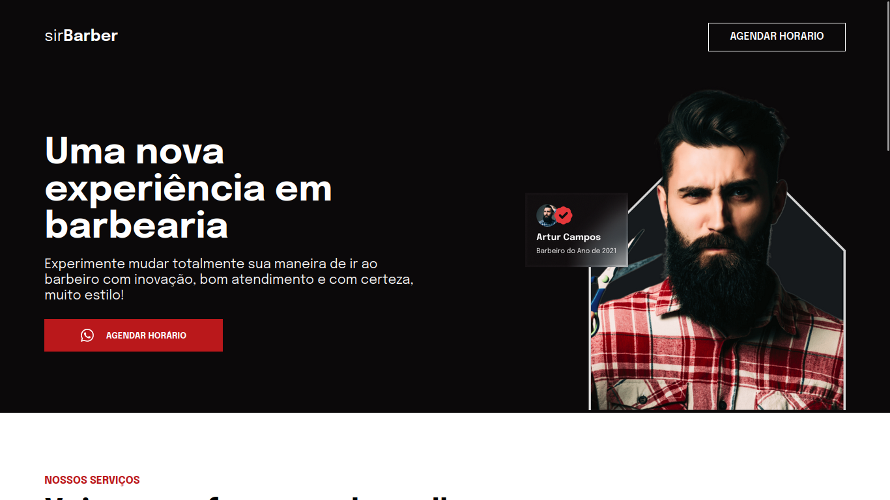

# Landing page barbearia

uma landing page com intuito de praticar HTML e CSS.

## 📁 Acesso ao projeto

[Veja o projeto final](https://stalwart-cannoli-193810.netlify.app).

## 🛠️ Abrir e rodar o projeto

Para abrir e rodar o projeto, basta abrir o aquivo `index.html` no navegador.

### Contatos

